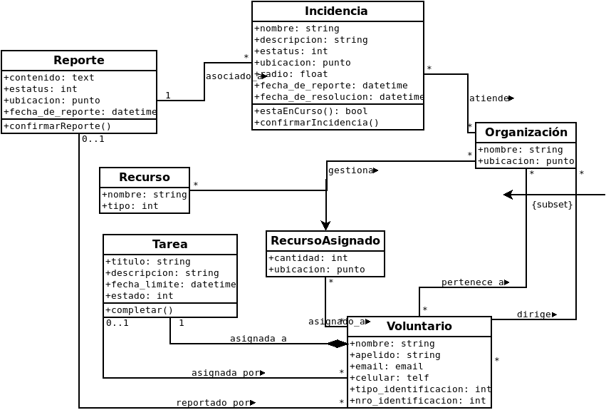

# aray-web

Repositorio para la aplicación web (punto de encuentro principal) del software de respuesta ante emergencias Aray.

## Base de Datos

### Por considerar en la base de datos

- Mensajes enviados por las organizaciones
- Integrar usuarios de Django con voluntarios
- Usuarios que emiten reporte, pueden ser usuarios anónimos
